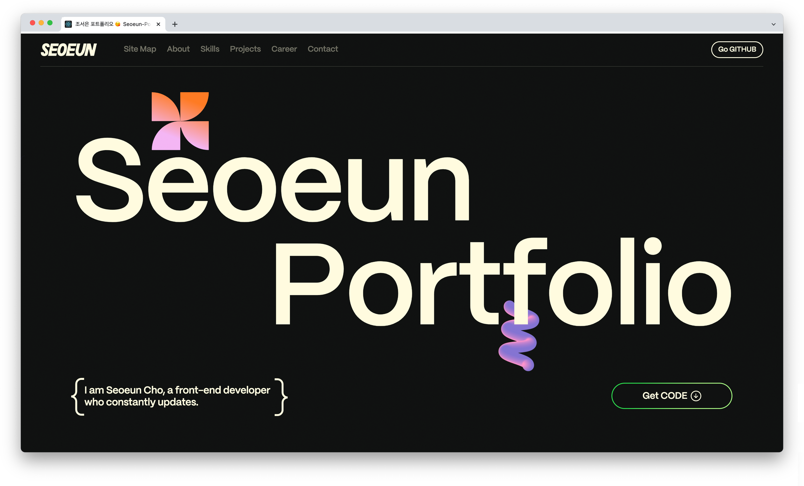
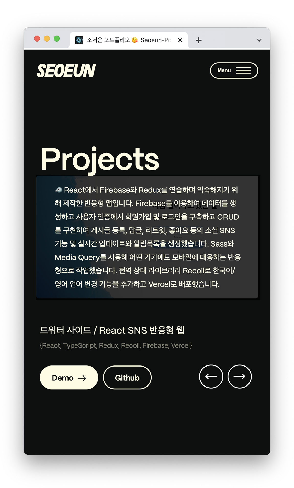
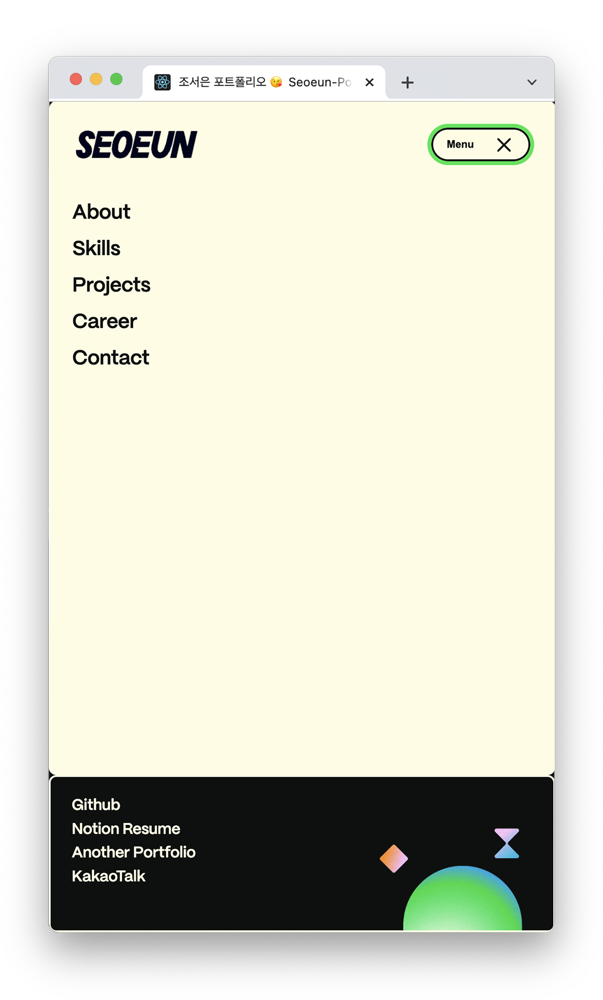
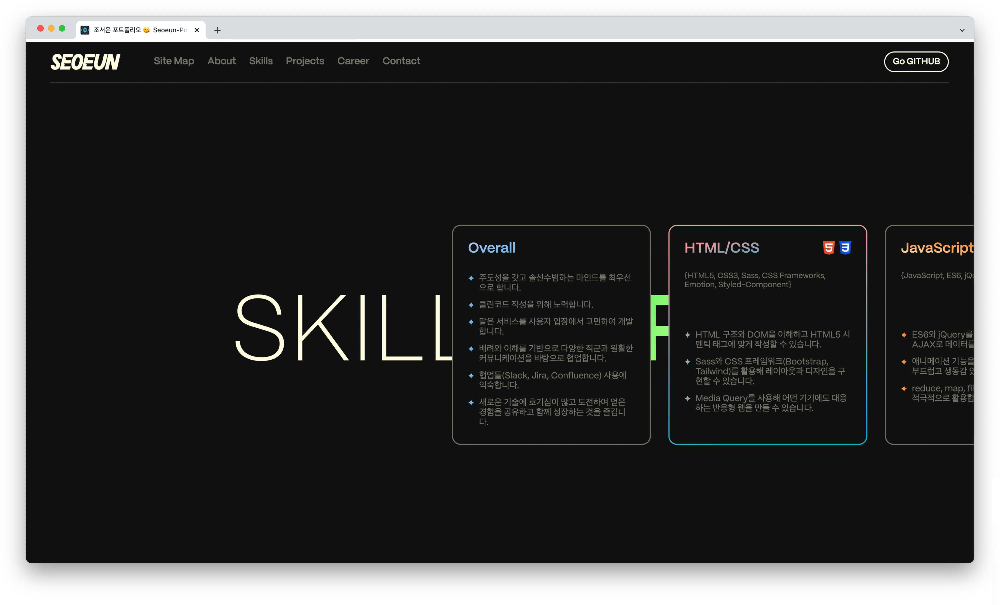
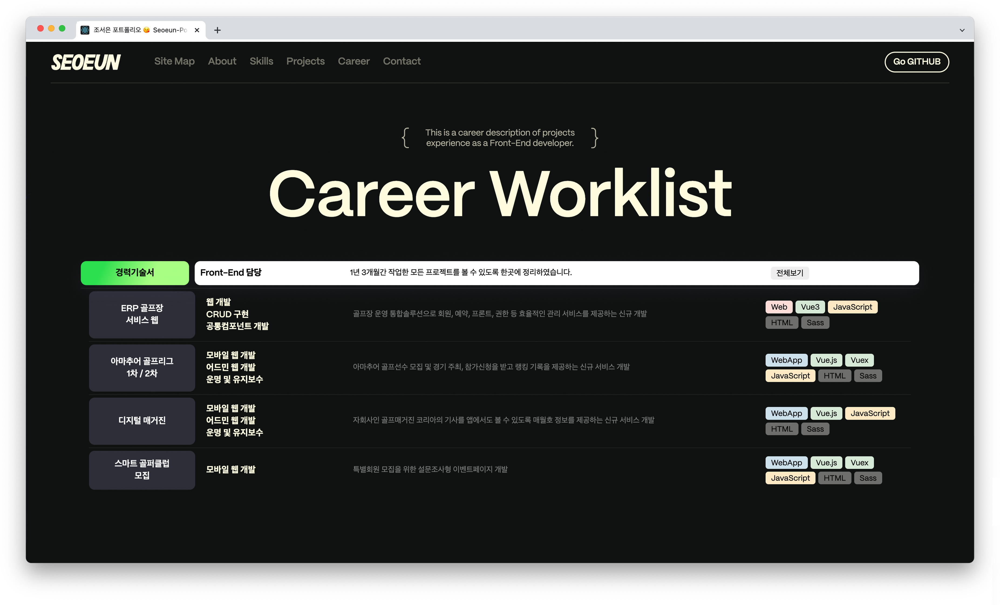

# React 포트폴리오 사이트 (ver.2023)

이 포트폴리오는 자기소개와 그동안 작업한 프로젝트들을 담은 `React`사이트입니다.
웹표준을 준수하며, `Sass`와 `Media Query`를 사용해 어떤 기기에도 대응하는 반응형으로 작업했습니다.
`GSAP`를 이용해 애니메이션을 구현하여 보는 재미를 더했습니다.
Career 섹션에서 Notion에 상세히 기록한 경력기술서도 확인할 수 있습니다.

> 👉 포트폴리오 보러가기 : [DEMO](https://seoeun-portfolio2023.netlify.app/) 

 

## 사용 스택

- React(https://ko.legacy.reactjs.org/) 를 사용하여 사이트를 번들링하고 관리합니다.
- GSAP(https://greensock.com/gsap) 를 이용하여 패럴랙스 효과를 줍니다.
- Lenis(https://lenis.studiofreight.com/) 를 이용하여 스무스 효과를 구현합니다.
- Swiper.js(https://swiperjs.com/) 를 사용하여 이미지 슬라이더를 구현합니다.
- React-Player(https://swiperjs.com/) 를 사용하여 이미지 슬라이더를 구현합니다.
- Netlify(https://www.netlify.com/) 를 통해 사이트를 배포합니다.
- Github(https://github.com/) 을 사용하여 파일을 관리합니다.
- HTML, SCSS 기반으로 웹사이트의 기본 레이아웃 설계하고, 웹 표준 및 웹 접근성을 준수하여 작업합니다.  
  [ARIA(Accessible Rich Internet Applications)](https://developer.mozilla.org/en-US/docs/Web/Accessibility/ARIA/Roles)

 

## 프로젝트 실행

- react를 설치합니다. `npx create-react-app 폴더명`
- react-router-dom을 설치합니다. `npm install react-router-dom`
- sass를 설치합니다. `npm install sass`
- gsap를 설치합니다. `npm install gsap`
- lenis를 설치합니다. `npm install @studio-freight/lenis`
- react-player를 설치합니다. `npm i react-player`

 

## Screenshots

  
  
  

